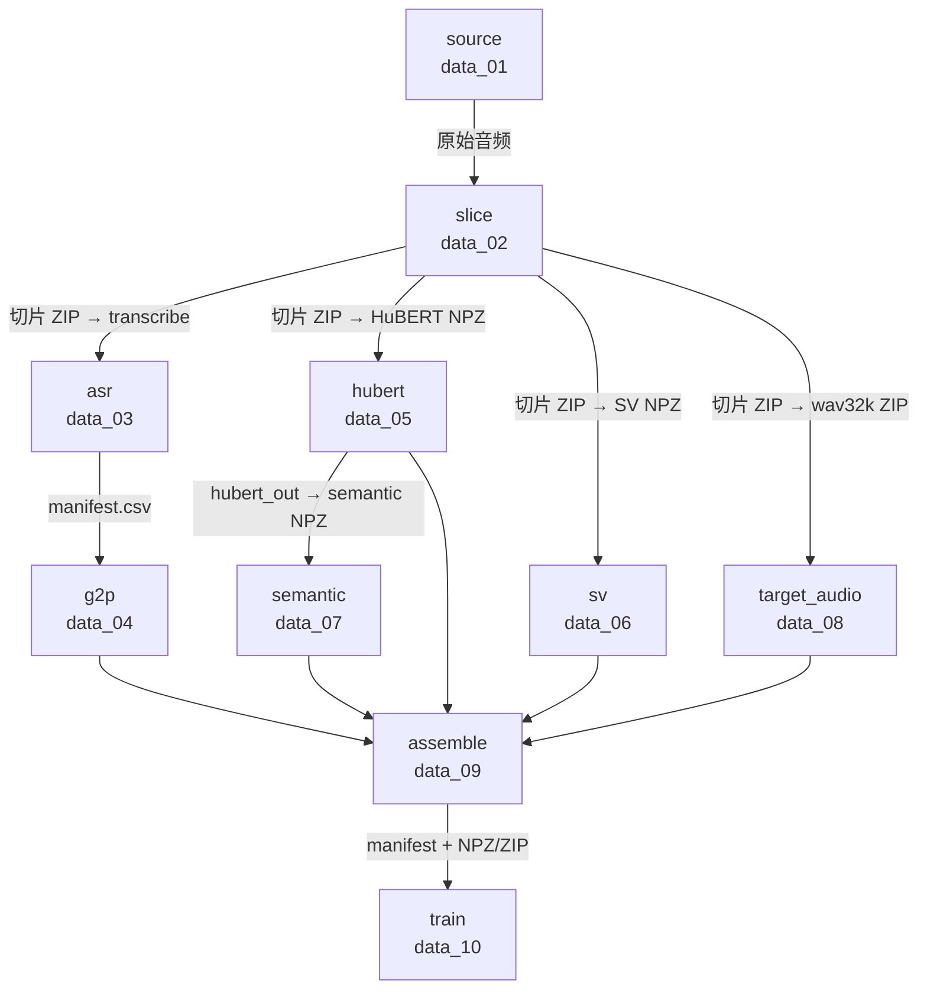
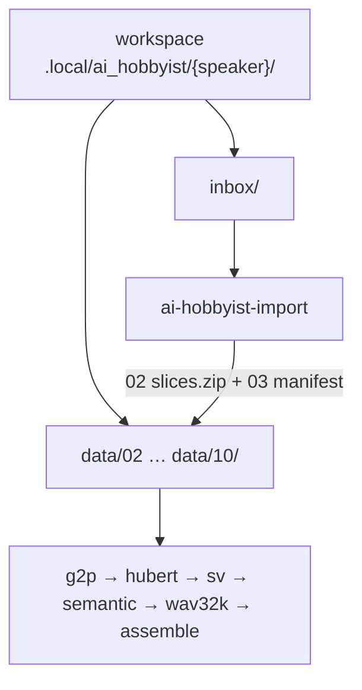

# 数据流

GPT-SoVITS 训练数据流水线的本地产物说明。

- **编排入口**：`uv run gpt-sovits-orchestrator`
- **默认输入**：`data_01/manbo.mp3`
- **产物目录**：`.local/data_01` … `.local/data_10`

## 总览



| 链路 | 路径 | 训练侧用途 |
|------|------|------------|
| **主链** | source → slice → asr → g2p | 文本 / 音素标注（GPT 文本侧） |
| **声学分叉 A** | slice → hubert → semantic | HuBERT 连续特征 → 离散 semantic token（GPT 声学侧标签） |
| **声学分叉 B** | slice → sv | 说话人 embedding（v2Pro 所需） |
| **声学分叉 C** | slice → target_audio | SoVITS s2 训练 target 音频（原 5-wav32k） |
| **汇合** | data_04–08 → assemble | 自定义 manifest 索引 NPZ/ZIP，对接 Dataset |
| **微调** | data_09 + data_05–08 → train | s1 `.ckpt` + s2 v2Pro `.pth`，可直接被官方 `api.py` / WebUI 加载 |

assemble **不**生成作者 `2-name2text.txt` / `6-name2semantic.tsv` 等散文件；重数据仍在 data_05–08，manifest 只做索引与审计元数据。

### 编排顺序

Prefect flow（`orchestrator_flow`）当前按下列顺序执行（hubert / sv / wav32k 之间无数据依赖，但代码中为串行）：

```text
slice → transcribe → g2p → hubert → sv → semantic → wav32k → assemble
                              ↑              ↑              ↑
                         data_02        hubert_out    data_04–08
```

| 阶段 | Prefect task | 需要服务 |
|------|--------------|----------|
| data_02 | `slice-audio` | asr-server |
| data_03 | `transcribe-slices` | asr-server |
| data_04 | `g2p-manifest` | nlp-server |
| data_05 | `hubert-from-zip` | asr-server |
| data_06 | `sv-from-zip` | asr-server |
| data_07 | `semantic-from-hubert-out` | tts-server |
| data_08 | `wav32k-from-zip` | **无**（纯本地） |
| data_09 | `assemble-manifest` | **无**（纯本地） |

### 服务与端口

| 服务 | 端口 | 负责阶段 |
|------|------|----------|
| asr-server | **19031** | slice、transcribe、HuBERT、SV |
| nlp-server | **19032** | G2P |
| tts-server | **19033** | semantic（v2pro） |

data_01、data_04 胶水、data_08–09 均为 orchestrator 本地处理；data_05–07 的模型推理在对应 server worker 内完成。

### 命名约定

- **`{base_name}`**：切片 wav 文件名前缀，如 `manbo`（来自 `{base_name}_{chunk:04d}_{start:010d}-{end:010d}.wav`）。
- **`{zip_stem}`**：切片 ZIP 文件名去扩展名，如 `manbo_slices`（默认 `{audio_stem}_slices.zip`）。
- **NPZ key**：与 ZIP 内 wav **文件名**一致（含 `.wav` 后缀），如 `manbo_0000_0000000000-0000214400.wav`；in/out 通过 NPZ **文件名**区分（`*_in.npz` / `*_out.npz`）。
- **CSV 文件名**：用 `{base_name}`，如 `manbo_manifest.csv`、`manbo_manifest_g2p.csv`、`manbo_manifest_assemble.csv`。
- **wav32k ZIP**：`data_08/{zip_stem}_wav32k.zip`；内部 entry 名与 `data_02` 切片 ZIP **完全一致**。

### 共用跳过规则

data_05、data_06、data_08 预处理均跳过（不中断整批、该条目不写入产物）：

- 峰值 `> 2.2`
- 纯静音

### 禁用接口

以下接口本质是胶水/调度，**不要**作为原子 API 调用：

- asr-server `POST /api/manifest`
- nlp-server `POST /api/g2p/csv`

---

## 01 · source

- **目录**：`data_01`
- **输入**：无（流水线起点）
- **产物**：原始音频，主流格式均可。默认示例：`manbo.mp3`

## 02 · slice

- **目录**：`data_02`
- **输入**：`data_01` 原始音频
- **产物**：切片 ZIP，默认 `{audio_stem}_slices.zip`（例：`manbo_slices.zip`）

### API（asr-server · 19031）

| 接口 | 用途 |
|------|------|
| `POST /api/audio/slice` | 上传原始音频，返回切片 ZIP |

- 上传：`multipart/form-data`，字段 `file`
- ZIP 内每个 wav 命名：`{base_name}_{chunk_index:04d}_{start:010d}-{end:010d}.wav`

## 03 · asr

- **目录**：`data_03`
- **输入**：`data_02` 切片 ZIP
- **产物**：`{base_name}_manifest.csv`（例：`manbo_manifest.csv`）

### API（asr-server · 19031）

| 接口 | 用途 |
|------|------|
| `POST /api/transcribe` | 上传单个 wav，返回转写 JSON |

响应体：

```json
{
  "transcribedText": "",
  "language": "",
  "languageProbability": 0
}
```

输出 CSV 表头：`filename,speaker,language,text,probability`

| 列 | 来源 |
|----|------|
| `filename` | wav 文件名（照抄 ZIP 内 entry 名） |
| `speaker` | `{base_name}` |
| `language` | 响应 `language` |
| `text` | 响应 `transcribedText` |
| `probability` | 响应 `languageProbability` |

## 04 · g2p

- **目录**：`data_04`
- **输入**：`data_03/{base_name}_manifest.csv`
- **产物**：`{base_name}_manifest_g2p.csv`（例：`manbo_manifest_g2p.csv`）
- **处理位置**：orchestrator 本地胶水 + nlp-server 原子 G2P

### API（nlp-server · 19032）

| 接口 | 用途 |
|------|------|
| `POST /api/g2p/ja` | 单段文本 G2P |

请求体：

```json
{
  "text": "",
  "mode": "prosody"
}
```

响应体：

```json
{
  "phones": []
}
```

输出 CSV 保留 data_03 的 5 列，并追加 6 列。完整表头：

`filename,speaker,language,text,probability,norm_text,phones,phone_count,word2ph,status,error`

| 追加列 | 说明 |
|--------|------|
| `norm_text` | 规范化后的日语文本 |
| `phones` | 空格分隔音素（GPT-SoVITS / symbols2 词表） |
| `phone_count` | `phones` token 数 |
| `word2ph` | 固定字符串 `None` |
| `status` | `ok` / `skip` / `error` |
| `error` | 跳过或失败原因 |

隐私过滤（硬编码，不满足则 `status=skip`）：

- 仅 `language == ja`
- 仅 `probability > 0.95`

本地胶水（标点切分/缝回、symbols2 对齐、词表校验）参考 `.local/TEMP/g2p`。

## 05 · hubert

- **目录**：`data_05`
- **输入**：`data_02` 切片 ZIP（不依赖 03/04）
- **产物**（`{zip_stem}` = 切片 ZIP stem）：

  - `data_05/{zip_stem}_hubert_in.npz` — 例：`manbo_slices_hubert_in.npz`
  - `data_05/{zip_stem}_hubert_out.npz` — 例：`manbo_slices_hubert_out.npz`

### 阶段 1：本地预处理（无需 API）

从 ZIP 内每个 wav 读取字节，转为 HuBERT extract 可读的 waveform，打包写入 `{zip_stem}_hubert_in.npz`。

| 属性 | 约定 |
|------|------|
| dtype | `float32` |
| shape | `(T,)` |
| 采样率 | 16000 Hz（逻辑约定，NPZ 不含 sr 元数据） |
| 归一化 | 1145.14 混合归一化（`NORM_SCALE=1145.14`） |

跳过规则见上文「共用跳过规则」。

### 阶段 2：HuBERT 特征提取（asr-server · 19031）

| 接口 | 用途 |
|------|------|
| `POST /api/features/chinese-hubert-base/start` | 批量前预加载 worker（可选） |
| `POST /api/features/chinese-hubert-base` | 上传 waveform `.npy`，返回 feature `.npy` |
| `POST /api/features/chinese-hubert-base/stop` | 批量结束后释放 worker |

- 上传：`multipart/form-data`，字段 `file`，文件名 `{stem}.npy`
- `{zip_stem}_hubert_out.npz` 每个 key → value shape `(1, T', 768)` float32

参考实现：`24-hubert/pipeline`（目录输出改为 NPZ 打包）。

## 06 · sv

- **目录**：`data_06`
- **输入**：`data_02` 切片 ZIP（不依赖 03/04/05）
- **产物**：

  - `data_06/{zip_stem}_sv_in.npz` — 例：`manbo_slices_sv_in.npz`
  - `data_06/{zip_stem}_sv_out.npz` — 例：`manbo_slices_sv_out.npz`

### 阶段 1：本地预处理（管道 B，无需 API）

| 属性 | 约定 |
|------|------|
| dtype | `float32` |
| shape | `(T,)` |
| 采样率 | 16000 Hz |
| 振幅 | 峰值归一化至约 `±0.95`（**不要** 1145.14 标度） |

跳过规则见上文「共用跳过规则」。

### 阶段 2：SV embedding 提取（asr-server · 19031）

| 接口 | 用途 |
|------|------|
| `POST /api/features/speech-eres2netv2w24s4ep4-sv-zh-cn-16k-common/start` | 批量前预加载 worker（可选） |
| `POST /api/features/speech-eres2netv2w24s4ep4-sv-zh-cn-16k-common` | 上传 sv_input `.npy`，返回 embedding `.npy` |
| `POST /api/features/speech-eres2netv2w24s4ep4-sv-zh-cn-16k-common/stop` | 批量结束后释放 worker |

- `{zip_stem}_sv_out.npz` 每个 key → value shape `(1, 20480)` float32

参考实现：`25-sv/pipeline`（目录输出改为 NPZ 打包）。

## 07 · semantic

- **目录**：`data_07`
- **输入**：`data_05/{zip_stem}_hubert_out.npz`（不依赖 03/04/06/08）
- **产物**：

  - `data_07/{zip_stem}_semantic_in.npz` — 例：`manbo_slices_semantic_in.npz`
  - `data_07/{zip_stem}_semantic_out.npz` — 例：`manbo_slices_semantic_out.npz`

对应 GPT-SoVITS 原流程 `3-get-semantic.py`：HuBERT 连续特征经 SoVITS v2Pro Vector Quantizer 离散化为 GPT 训练用语义 token。

### 阶段 1：本地转置（无需 API）

从 `hubert_out` NPZ 读取每个 key，转置后写入 `{zip_stem}_semantic_in.npz`。

| | shape | dtype |
|--|-------|-------|
| 输入（hubert_out） | `(1, T, 768)` | float32 |
| 输出（semantic_in） | `(1, 768, T)` | float32 |

仅 `transpose(0, 2, 1)`，无其它预处理。

### 阶段 2：Semantic token 提取（tts-server · 19033）

| 接口 | 用途 |
|------|------|
| `POST /api/features/v2pro/start` | 批量前预加载 worker（可选） |
| `POST /api/features/v2pro` | 上传已转置 ssl `.npy`，返回 semantic `.npy` |
| `POST /api/features/v2pro/stop` | 批量结束后释放 worker |

- 上传：`multipart/form-data`，字段 `file`，文件名 `{stem}.npy`
- **服务端不做 transpose**；须上传 `(1, 768, T)` 格式
- `{zip_stem}_semantic_out.npz` 每个 key → value shape `(T_sem,)` int32，`T_sem = T/2`，token ∈ `[0, 1023]`
- 健康检查：`GET /api/hello`（根路径 `/` 无路由）

参考实现：`26-semantic/pipeline`（目录输出改为 NPZ 打包）。

## 08 · target_audio（wav32k）

- **目录**：`data_08`
- **输入**：`data_02/{zip_stem}.zip`（不依赖 03/04/05/06/07）
- **产物**：`data_08/{zip_stem}_wav32k.zip`（例：`manbo_slices_wav32k.zip`）
- **处理位置**：仅 orchestrator 本地胶水（**无 API / Worker**）

对应 GPT-SoVITS 原流程 `2-get-hubert-wav32k.py` 写 `5-wav32k` 的 **32768 分支**：SoVITS s2 训练用的 target 音频。

### 本地处理（纯信号）

从切片 ZIP 逐条读取 wav，处理后写回同名 entry：

```text
读 wav @ 32kHz → 峰值检查 → 混合归一化 (×32768) → int16 PCM → 写入 zip
```

| 属性 | 约定 |
|------|------|
| 容器 | ZIP，entry 名与 data_02 **完全一致** |
| 采样率 | 32000 Hz |
| dtype | `int16` PCM |
| 归一化 | RVC/SoVITS 32768 混合分支（`NORM_MAX=0.95`, `NORM_ALPHA=0.5`, `INT16_SCALE=32768`） |

跳过规则见上文「共用跳过规则」。

参考实现：`24-hubert/preprocess_wav32k.py`（散文件 `5-wav32k/` 改为 ZIP 打包）。

## 09 · assemble

- **目录**：`data_09`
- **输入**：`data_04` g2p manifest + `data_05`–`data_08` 模态仓库
- **产物**：`{base_name}_manifest_assemble.csv`（例：`manbo_manifest_assemble.csv`）
- **处理位置**：仅 orchestrator 本地胶水（**无 API / Worker**）

**不**导出作者训练目录（`2-name2text.txt`、`6-name2semantic.tsv`、`5-wav32k/` 等）。orchestrator 已具备等价模型级数据，assemble 产出 **自定义 Dataset 索引 manifest**：文本列在 CSV，semantic / hubert / sv / wav32k 仍按 `filename` 懒加载 NPZ/ZIP。

### 交集条件

写入 manifest 前过滤：

```text
g2p.status == "ok"
∧ filename ∈ hubert_out.npz
∧ filename ∈ sv_out.npz
∧ filename ∈ semantic_out.npz
∧ filename ∈ wav32k.zip
```

主键 **`filename`** 与 NPZ key、wav32k zip entry **完全一致**（含 `.wav`）。manbo 示例约 **95** 行（132 切片中 g2p ok 与模态 key 的交集）。

### 表头（17 列）

```csv
filename,speaker,language,text,probability,norm_text,phones,phone_count,word2ph,status,error,semantic_count,hubert_T,sv_dim,wav32k_bytes,eligible_gpt,eligible_sovits
```

| 分组 | 列 | 说明 |
|------|-----|------|
| A · 文本主链 | `filename` … `error`（11 列） | 继承 `data_04`，原样照抄 |
| B · 模态审计 | `semantic_count`, `hubert_T`, `sv_dim`, `wav32k_bytes` | assemble 时从 NPZ/ZIP 计算；**不含**大数组 |
| C · 训练资格 | `eligible_gpt`, `eligible_sovits` | 交集内均为 `true`；将来可按缺模态单独置 `false` |

模态审计列来源：

| 列 | 来源 |
|----|------|
| `semantic_count` | `data_07` semantic_out `[filename].shape[0]` |
| `hubert_T` | `data_05` hubert_out `[filename].shape[1]`（`(1,T,768)` 的时间维） |
| `sv_dim` | `data_06` sv_out `[filename].shape[-1]`（应为 20480） |
| `wav32k_bytes` | `data_08` zip 内该 entry 未压缩大小 |

重数据懒加载（Dataset 按 `filename` 读取）：

| 模态 | 仓库 | 模型级 shape |
|------|------|----------------|
| semantic | `data_07/*_semantic_out.npz` | `(T_sem,)` int32 |
| hubert | `data_05/*_hubert_out.npz` | `(1, T, 768)`（s2 侧需 transpose） |
| sv | `data_06/*_sv_out.npz` | `(1, 20480)` |
| wav32k | `data_08/*_wav32k.zip` | 32 kHz int16 wav |

时长 / phoneme–semantic 比例等训练过滤放在 **Dataset 初始化**，不写入 manifest。

### Dataset 用法示意

```text
manbo_manifest_assemble.csv
        │
        ├─ GPT s1 Dataset    → phones, norm_text, word2ph + data_07 semantic NPZ
        └─ SoVITS s2 Dataset → phones + data_05 hubert + data_06 sv + data_08 wav32k
```

---

## 产物速查

以默认 `manbo.mp3` 为例，完整跑通后主要文件：

| 目录 | 文件 |
|------|------|
| `data_01` | `manbo.mp3` |
| `data_02` | `manbo_slices.zip` |
| `data_03` | `manbo_manifest.csv` |
| `data_04` | `manbo_manifest_g2p.csv` |
| `data_05` | `manbo_slices_hubert_in.npz`、`manbo_slices_hubert_out.npz` |
| `data_06` | `manbo_slices_sv_in.npz`、`manbo_slices_sv_out.npz` |
| `data_07` | `manbo_slices_semantic_in.npz`、`manbo_slices_semantic_out.npz` |
| `data_08` | `manbo_slices_wav32k.zip` |
| `data_09` | `manbo_manifest_assemble.csv` |
| `data_10` | `manbo.ckpt`、`manbo.pth` |

manifest 每行 `filename` 对应 data_05–08 中同名 key / zip entry；交集行数 ≤ g2p `status=ok` 行数。

---

## AI-Hobbyist 流水线（外部 wav + lab 数据集）

面向 [AI-Hobbyist](https://github.com/AI-Hobbyist) 等**已切片、已标注**数据集：跳过 `data_01` 切片与 `data_03` ASR，从 wav+lab 导入后接入 **g2p → … → assemble** 共用尾链。

- **编排入口**：`uv run gpt-sovits-orchestrator-ai-hobbyist jinxi`
- **Prefect flow 名**：`ai-hobbyist-orchestrator`
- **代码包**：`src/gpt_sovits_orchestrator/ai_hobbyist/`（Python `snake_case`）



每个角色拥有**独立工作区**，与 manbo 的 `.local/data_01`…`data_10` **完全隔离**。

```text
.local/ai_hobbyist/jinxi/
  inbox/                    ← 你只放 wav+lab
  data/
    02/  jinxi_slices.zip
    03/  jinxi_manifest.csv
    04/  jinxi_manifest_g2p.csv
    05/  jinxi_slices_hubert_*.npz
    06/  jinxi_slices_sv_*.npz
    07/  jinxi_slices_semantic_*.npz
    08/  jinxi_slices_wav32k.zip
    09/  jinxi_manifest_assemble.csv
    10/  jinxi.ckpt, jinxi.pth
```

### 准备数据

为角色选一个 **ASCII speaker slug**（小写，如 `jinxi` 表示今汐）。两种方式二选一：

**方式 A — 拷贝到角色 inbox（推荐）**

```text
.local/ai_hobbyist/jinxi/inbox/
  ja_vo_Huanglong_main_1_5_81_38.wav
  ja_vo_Huanglong_main_1_5_81_38.lab
  ...
```

从 AI-Hobbyist 仓库拷贝同名 `.wav` 与 `.lab` 即可；**保留原始文件名**，不做重命名。

**方式 B — 直接指向外部目录（免拷贝）**

在根目录 `.env` 中设置：

```env
AI_HOBBYIST_SPEAKER=jinxi
AI_HOBBYIST_INBOX_DIR=E:\WorkSpace\Projects_GitHub\AI-Hobbyist\WutheringWaves2.2_JP\日语 - Japanese\今汐
```

产物仍写入 `.local/ai_hobbyist/jinxi/data/`，不污染全局 `data_XX`。

### 导入规则（`ai-hobbyist-import`）

| 规则 | 说明 |
|------|------|
| 配对 | 每个 `*.wav` 须有同名 `*.lab`（同 stem） |
| `filename` | manifest 与 ZIP entry 均使用 **wav 原始文件名**（含 `.wav`） |
| 跳过 | 无 `.lab` 或 `.lab` 为空的 wav 不写入产物 |
| `speaker` | CSV `speaker` 列 = slug（如 `jinxi`） |
| `language` / `probability` | 默认 `ja` / `0.99`（可通过 `.env` 调整） |
| ZIP 名 | `{speaker}_slices.zip`，与 manbo 的 `{audio_stem}_slices.zip` 约定一致 |

**不**检测 `manbo_0000_...` 切片命名；04 之后与干音流水线完全相同。

### 运行

```powershell
# 根目录 .env 中可选 AI_HOBBYIST_SPEAKER / AI_HOBBYIST_INBOX_DIR
uv run gpt-sovits-orchestrator-ai-hobbyist jinxi
```

产出示例（`speaker=jinxi`）均在 `.local/ai_hobbyist/jinxi/data/` 下：

| 阶段目录 | 文件 |
|----------|------|
| `data/02` | `jinxi_slices.zip` |
| `data/03` | `jinxi_manifest.csv` |
| `data/04` | `jinxi_manifest_g2p.csv` |
| `data/05`–`08` | `jinxi_slices_*`（NPZ/ZIP） |
| `data/09` | `jinxi_manifest_assemble.csv` |
| `data/10` | `jinxi.ckpt`、`jinxi.pth` |

### 训练

在 `packages/gpt-sovits-trainer/.env` 中指向同一工作区：

```env
TRAINER_WORKSPACE=ai_hobbyist/jinxi
TRAINER_BASE_NAME=jinxi
TRAINER_ZIP_STEM=jinxi_slices
```

然后 `uv run gpt-sovits-trainer`，权重写入 `ai_hobbyist/jinxi/data/10/`，**不覆盖** manbo 的 `data_10/`。

---

## 10 · 微调训练（`packages/gpt-sovits-trainer` → `data_10`）

独立 **Python 3.10** 子项目，读取 `data_09` assemble manifest 与 data_05–08 重数据，用自研 s1/s2 训练循环 + 精简 vendor 模型定义完成 v2Pro 微调，产出写入 **`data_10/`**。

**与作者原项目对齐**：`data_10` 产出为官方 **推理导出格式**（`GPT_weights/*.ckpt`、`SoVITS_weights/*.pth` 同类），`api.py`、经典 WebUI、`inference_webui_fast.py` 共用同一套 loader，**无需**在 Colab 或推理侧再做格式修补。

> 训练过程中的 Lightning / GAN **断点**（`logs_s1/ckpt/`、`logs_s2_*/G_*.pth`）属于续训用途；本流水线不写入 `data_10/`，仅保留最终可推理权重。

### 运行

orchestrator 侧：复制根目录 [`.env.example`](../.env.example) 为 `.env`。  
trainer 侧：复制 [`packages/gpt-sovits-trainer/.env.example`](../packages/gpt-sovits-trainer/.env.example) 为 `packages/gpt-sovits-trainer/.env`。  
各 server（Whisper 模型等）见各自仓库的 `.env.example`。

```powershell
cd packages/gpt-sovits-trainer
uv sync
uv run gpt-sovits-download-models
uv run gpt-sovits-trainer
```

若本机 `PYTHONPATH` 指向外部 GPT-SoVITS 仓库，可能误导入带额外依赖的 vendor 代码。可显式锁定 bundled vendor：

```powershell
$v = "packages/gpt-sovits-trainer/vendor"
$env:GPT_SOVITS_ROOT = "$v/GPT_SoVITS"
$env:PYTHONPATH = "$v;$env:GPT_SOVITS_ROOT"
uv run gpt-sovits-trainer
```

### 验收产物（manbo 示例）

| 文件 | 说明 |
|------|------|
| `data_10/manbo.ckpt` | GPT s1（底模 `s1v3.ckpt` 微调） |
| `data_10/manbo.pth` | SoVITS s2 v2Pro（底模 `s2Gv2Pro.pth` + `s2Dv2Pro.pth`） |

底模位于 `packages/gpt-sovits-trainer/.models/pretrained/`。

### 权重格式（与 `process_ckpt.savee` / `s1_train` 导出一致）

| 文件 | 结构 | 要点 |
|------|------|------|
| `.ckpt` | `{ weight, config, info }` | `weight` 键名带 **`model.*`** 前缀；`config.data.max_sec` 必填（默认 54） |
| `.pth` (v2Pro) | `{ weight, config, info }` | 文件头 **`b"05"`**；`weight` 为 fp16、**不含** `enc_q`；`config` 为完整 `s2v2Pro.json` |

### Colab 试听（可选）

本地测试材料：`.local/TEMP/data_10_test/`

| 文件 | 用途 |
|------|------|
| `data_10_colab_test.ipynb` | 官方 Colab 环境 + `api.py` 子进程推理 |
| `ref_manbo_0000.wav` | 参考音频（data_02 第一条切片） |
| `ref_prompt.txt` | 参考 prompt 文本（语种 `ja`） |

上传到 Colab `/content/data_10_test/` 的权重文件：**重新训练后的** `manbo.ckpt`、`manbo.pth`（与上表格式一致，无需 `_api` 修补）。

详见 [packages/gpt-sovits-trainer/README.md](../packages/gpt-sovits-trainer/README.md) 与 [vendor/README.md](../packages/gpt-sovits-trainer/vendor/README.md)。
